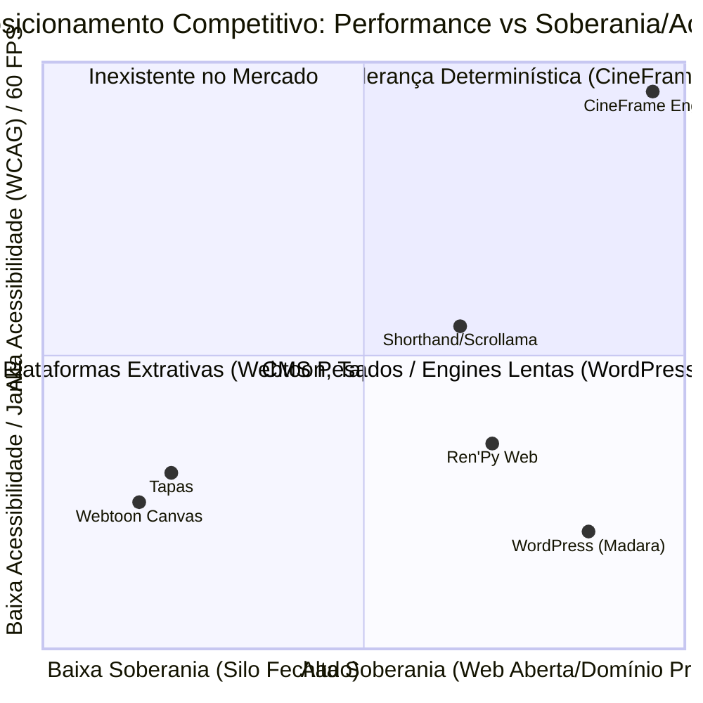

# Relatório Executivo Consolidado: Estratégia de Brand, Naming, Posicionamento, Monetização e Go-To-Market

**Data:** 30 de Setembro de 2026  
**Projeto:** `horror-web-comic`  
**Metodologia:** Suíte de frameworks `phuryn/pm-skills` (The Product Compass)  
**Clusters de Análise:**
- **Brand & Naming:** `product-vision`, `value-proposition` (JTBD), `product-name`
- **Posicionamento Competitivo:** `competitor-analysis`, `positioning-ideas`, `value-prop-statements`
- **Monetização & Precificação:** `product-strategy`, `monetization-strategy`, `pricing-strategy`
- **GTM, Growth Loops & Marketing:** `gtm-motions`, `growth-loops`, `marketing-ideas`

---

## 1. Diagnóstico Central: Precisamos de um nome de produto/brand/marca?

### Resposta Categórica: **SIM, sob uma Arquitetura de Marca Desacoplada (*Endorsed Brand Architecture*).**

O repositório foi batizado tecnicamente como `horror-web-comic`. Esse nome atende provisoriamente ao código, mas gera um **conflito fatal de posicionamento** se for tratado como marca única comercial:

```
                          ARQUITETURA DE MARCA DESACOPLADA
                          
         ┌──────────────────────────────────────────────────────────────┐
         │             CineFrame Engine (ou Cadência Engine)             │
         │      Toolkit & Engine Determinística de Publicação Web       │
         │     (B2B / Creator Economy / Estúdios / Museus / Editais)     │
         └──────────────────────────────┬───────────────────────────────┘
                                        │
                               Endossa e viabiliza
                                        │
                                        ▼
         ┌──────────────────────────────────────────────────────────────┐
         │                    A Casa que Respira                        │
         │              "Powered by CineFrame Engine"                   │
         │         Obra Flagship / Graphic Novel de Terror Interativo   │
         │                   (B2C / Audiência / Leitores)               │
         └──────────────────────────────────────────────────────────────┘
```

1. **A Engine / Starter Kit (Tecnologia/Infraestrutura B2B/B2Creator):** Não pode chamar "horror". Se chamar horror, um museu histórico, uma editora de ficção científica ou um estúdio infanto-juvenil recusará a contratação de serviço (Oferta A) ou o licenciamento institucional (Oferta C). A marca da engine precisa evocar **precisão, cinema determinístico, fluidez a 60 FPS e acessibilidade universal auditada**.
2. **A Obra Insígnia (Propriedade Intelectual Narrativa B2C):** É a vitrine (*showpiece* / *dogfooding*) de terror e suspense psicológico. Ela precisa de um título visceral, atmosférico e focado na tensão do leitor: **A Casa que Respira** (*The Breathing House*).

---

## 2. Naming & Brand Foundation

### 2.1 Visões de Produto (North Star)
* **Para a Engine:** *"Dar aos contadores de histórias o poder do cinema determinístico na web: zero atrito de runtime, 60 quadros por segundo e acessibilidade sensorial irrestrita para cada leitor do planeta."*
* **Para a Obra Narrativa Flagship:** *"Fazer o leitor prender a respiração a cada virada de tela, transformando seu dispositivo em uma janela viva e perturbadora para o medo psicológico mais palpável."*

### 2.2 As 5 Propostas de Nomes para a Engine / Toolkit

| # | Nome | Rationale & Significado | Tom & Fit | Domínio & Registro |
|---|---|---|---|---|
| **1** | **CineFrame Engine** *(Recomendado)* | Fusão de *Cinema* com a unidade estrutural da web e dos quadrinhos (*Frame* / taxa de quadros a 60fps). | Profissional, industrial, focado em arte sequencial de alta fidelidade. | `cineframe.dev`, `cineframe.io`. Alta distintividade combinada. |
| **2** | **Cadência Engine** (ou *Cadence*) | Cadência é o compasso, ritmo dramático do suspense e taxa rítmica de quadros e áudio. | Elegante, autoral, artístico, padrão Aroeira de sofisticação. | `cadence-engine.org`, `cadencejs.dev`. Usar descritor funcional. |
| **3** | **PulsePress** | Conecta a tradição editorial (*Press*) ao batimento cardíaco da interatividade em tempo real (*Pulse*). | Enérgico, ponte perfeita entre impresso fino e digital ágil. | `pulsepress.dev`, `pulsepress.org`. |
| **4** | **Vellum60** | *Vellum* (o pergaminho translúcido nobre de ilustrações clássicas) + *60* (a taxa sagrada de 60 FPS estável). | Cult, engenharia refinada que respeita a integridade do traço. | `vellum60.dev`, `vellum60.io`. |
| **5** | **AuraFrame** | A atmosfera invisível que envolve cada cena: som ambiente, luz e suspense psicológico. | Místico, moderno, imersivo. | `auraframe.dev`, `aura-engine.io`. |

### 2.3 Nomes para a Obra Insígnia (Flagship)
1. **A Casa que Respira** *(The Breathing House)* — **(Eleito)**: Perfeito para animismo sobrenatural e áudio sincronizado com a respiração do leitor.
2. **Volte Quando Ela Acordar** *(Return When She Wakes)*: Extraído diretamente da placa de advertência do Frame 01.
3. **Onde a Madeira Estala** *(Where the Timber Creaks)*: Foco no design de som sensorial.

---

## 3. Posicionamento Competitivo & Proposta de Valor

### 3.1 Mapeamento da Concorrência & Flancos Desprotegidos



* **Webtoon Canvas & Tapas:** Tráfego massivo, mas são silos proprietários. Retêm 30-50% da receita, proíbem controle de áudio orquestrado e possuem **acessibilidade zero para pessoas cegas**.
* **Temas WordPress (Madara / ComicKit):** Soberania de domínio, mas com **performance catastrófica** (LCP > 5s, jank severo, dependência de plugins inseguros e zero conformidade WCAG).
* **Ren'Py Web / Twine:** Runtimes inchados (downloads de 30MB+ via WASM), incompatíveis com redes lentas e hostis a leitores de tela.

### 3.2 O Flanco Desprotegido Dominado pelo CineFrame:
> **"A primeira engine estática de scrollytelling e webcomics com 60 FPS determinístico garantido, zero dependência de servidor e conformidade universal WCAG AA/AAA auditada."**

### 3.3 Declarações de Proposta de Valor (Segmentadas)
* **Para Criadores e Autores (Marketing):** *"Pare de espremer sua arte em templates de rolagem lenta. Crie quadrinhos cinematográficos com direção de cena e áudio atmosférico a 60 FPS, mantendo 100% dos seus direitos e do seu domínio."*
* **Para Editais, Museus e Fundos Públicos (Vendas Institucionais):** *"A única infraestrutura narrativa estática projetada nativamente sob as normas da Lei Brasileira de Inclusão (Lei 13.146) e WCAG 2.2, entregue com dossiê de auditoria técnica assinado e custo zero de servidores."*
* **Para Desenvolvedores (Onboarding):** *"Narrativa declarativa baseada em manifesto JSON (`story.json`). Sem React, sem Next.js, sem complexidade de backend: um comando compila imagens responsivas, gera áudio leve e valida compatibilidade em 5 navegadores."*

---

## 4. Estratégia de Monetização, Precificação & Defensabilidade

### 4.1 Como monetizar se o código é MIT e público?
O código base do player é público, mas **o código não é o ativo vendável**. O que se comercializa é a **responsabilidade técnica e o Portão Determinístico**:
1. O conhecimento operacional para configurar a matriz de 5 navegadores (incluindo WebKit desktop e mobile no macOS).
2. A garantia de atualização contínua e mitigação de breaking changes de browsers.
3. O laudo de conformidade técnica e acessibilidade assinado (essencial para compras públicas e editais culturais onde o risco de impugnação é crítico).

### 4.2 Tabela Oficial de Ofertas e Tiers de Precificação

| Oferta | Modalidade | Tier | Preço | O que Entrega |
|---|---|---|---|---|
| **Oferta A** | **Serviço por Episódio** *(Done-For-You)* | A1 Curta | R$ 1.200 / ep | Até 20 quadros, sem áudio, laudo Lighthouse |
| | | **A2 Média (Âncora)** | **R$ 2.400 / ep** | **21–45 quadros, áudio/trilha orquestrada, variantes leves** |
| | | A3 Longa | R$ 4.000 / ep | 46+ quadros, transições sob medida, temporada completa |
| **Oferta B** | **Starter Kit Comercial** *(Licença Perpétua)* | B1 Série | R$ 199 / US$ 39 | 1 série garantida, 12 meses de atualizações e suporte |
| | | **B2 Estúdio (Âncora)** | **R$ 299 / US$ 69** | **Até 5 séries, automação completa de encoders de mídia** |
| | | B3 Catálogo | R$ 499 / US$ 119 | Séries ilimitadas, 24 meses de updates, 60min onboarding |
| **Oferta C** | **Licenciamento Institucional** | C1 Portal | R$ 8.000 | Site/acervo único, dossiê de acessibilidade, laudo assinado |
| | | **C2 Exposição (Âncora)** | **R$ 18.000** | **C1 + Treinamento de equipe + 1 ano de suporte de conformidade** |
| | | C3 Acervo | R$ 30.000 | Multi-site para grandes museus, emissoras e editoras |
| **Recorrente** | **Retainer de Conformidade** | Anual | **R$ 1.200 a 3.600/ano** | Reauditoria anual e emissão de laudo técnico atualizado (~15% de C) |

---

## 5. Go-To-Market, Growth Loops & Marketing Orgânico

### 5.1 O Growth Loop Inerente: *Reader-to-Creator Flywheel*

```
[Leitor acessa o quadrinho flagship "A Casa que Respira"]
       │
       ▼
[Experiência fluida: 60 FPS, som ambiente arrepiante, sem lag em 3G]
       │
       ▼
[Colofão no Frame Final: "Powered by CineFrame Engine • 0 Trackers • 100% Acessível"]
       │
       ▼
[1 em cada N leitores é quadrinista, ilustrador ou produtor cultural]
       │
       ▼
[Entrada de Fricção Zero: Arrasta seu story.json no Validador Web gratuito]
       │
       ▼
[Contrata o Serviço A ou compra o Starter Kit B para sua própria história]
```

### 5.2 As 5 Campanhas de Marketing de Custo Zero (Alto Impacto)

1. **O "Desafio do 3G / PageSpeed Teardown" (Inbound Dev/Comics):** Thread comparativa demonstrando como sites comuns de webcomic consomem 40MB e demoram 12s para abrir com jank, enquanto o CineFrame entrega a mesma obra em 4MB, a 60 FPS e com pontuação 100 no Lighthouse.
2. **Validador de Manifesto "Drag-and-Drop" de Bolso:** Extrair o `compatibility-report.mjs` para uma página web única e estática onde quadrinistas arrastam suas imagens e descobrem instantaneamente se sua arte quebrará no Safari ou estourará limites de dados móveis.
3. **Colofão Tecnológico Transparente no Final da Obra:** O frame final de *A Casa que Respira* apresenta uma assinatura estética e ética: *"Construído para a web livre: sem trackers de espionagem, carregamento instantâneo, acessibilidade total. Crie a sua história."*
4. **Aliança com Auditores e Consultores Freelancers de Acessibilidade (WCAG):** Parceria ativa com profissionais que elaboram pareceres para editais públicos e precisam de uma engine web comprovadamente acessível para recomendar a museus e secretarias.
5. **Starter Pack para Game Jams de Terror no Itch.io:** Divulgação do Starter Kit durante jams narrativas (ex: *Spooktober Jam*) como a alternativa ultra-rápida a exportações pesadas de Unity/Ren'Py que demoram minutos para carregar no celular.

---

## 6. Próximos Passos de Execução Imediata

1. **Padronização Visual da Obra:** Manter o título oficial da história no manifesto como **"A Casa que Respira"** e adicionar no frame de créditos o colofão discreto: *"Powered by CineFrame Engine"*.
2. **Página de Oferta e Validador (Fora do Repo):** Montar o validador web cliente baseado em `scripts/compatibility-report.mjs` na landing page externa para alimentar o funil PLG.
3. **Outbound Qualificado para a Oferta A:** Iniciar a abordagem ativa de criadores em financiamento coletivo (Catarse/Kickstarter), utilizando auditorias reais como âncora de credibilidade técnica.
