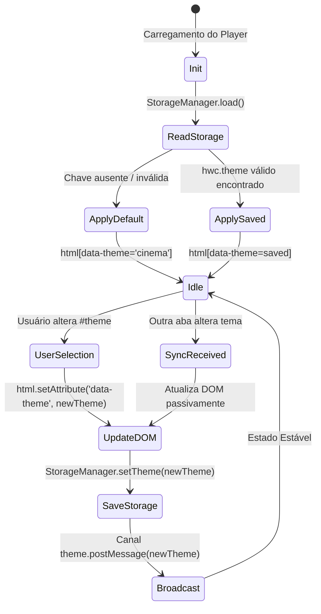

# Data Model: Theme Switcher de 5 Atmosferas Dramáticas

**Feature**: `002-theme-switcher` | **Date**: 2026-09-30 | **Spec**: [spec.md](./spec.md)

Modelo de dados e estados derivado da especificação formal. A funcionalidade opera sem backend; todos os estados residem no DOM e no armazenamento local do navegador.

---

## 1. Entidade: ThemeOption

Representa uma das cinco atmosferas estéticas disponíveis para o leitor.

| Campo | Tipo | Valores Válidos | Descrição |
|:---|:---|:---|:---|
| `id` | String | `'cinema'` \| `'noir'` \| `'eldritch'` \| `'industrial'` \| `'shadow-props'` | Identificador canônico do tema aplicado no atributo `data-theme` do elemento raiz `<html>`. |
| `name` | String | `'Minimalist Cinema'` \| `'Graphic Novel Noir'` \| `'Atmospheric Eldritch'` \| `'Industrial Brutalist'` \| `'Shadow-Props Base'` | Nome legível para rótulos de interface e acessibilidade. |
| `description` | String | Texto descritivo | Resumo da atmosfera visual (usado em tooltips / documentação). |
| `isDefault` | Boolean | `true` (apenas para `'cinema'`) \| `false` | Indica se é o tema padrão de primeira visita. |

### Matriz de Mapeamento dos 5 Temas

| ID | Nome de Apresentação | Família Display | Cor de Fundo Principal | Cor de Foco / Acento | Relação de Contraste |
|:---|:---|:---|:---|:---|:---:|
| `cinema` | Cinema Minimalista [Padrão] | `system-ui, sans-serif` | `#060608` | `#ffffff` | **17.2:1** |
| `noir` | Graphic Novel Noir | `Impact, sans-serif` | `#050507` | `#ff2a44` | **17.8:1** |
| `eldritch` | Atmospheric Eldritch | `Cinzel, Georgia, serif` | `#040507` | `#fdd677` | **15.4:1** |
| `industrial` | Industrial Brutalist | `ui-monospace, monospace` | `#08090a` | `#ffb82e` | **10.5:1** |
| `shadow-props` | Shadow-Props Base | `Georgia, serif` | `#07080d` | `#ffe2a1` | **17.5:1** |

---

## 2. Entidade: ThemeState (Memória do Runtime)

Estado ativo do tema projetado na aplicação durante a sessão.

| Propriedade | Tipo | Descrição |
|:---|:---|:---|
| `currentTheme` | `ThemeOption['id']` | Identificador do tema ativo aplicado no `document.documentElement`. |
| `source` | `'default'` \| `'storage'` \| `'user-action'` \| `'broadcast'` | Origem do evento que determinou o tema atual. |

---

## 3. Projeção Persistida: StorageState

Contrato de persistência serializada em `localStorage`.

| Chave | Tipo | Valor Padrão | Validação & Tratamento de Erros |
|:---|:---|:---|:---|
| `hwc.theme` | String | `'cinema'` | Deve pertencer estritamente ao conjunto `['cinema', 'noir', 'eldritch', 'industrial', 'shadow-props']`. Qualquer valor desconhecido, corrompido ou nulo é descartado e substituído pelo padrão `'cinema'`. |

---

## 4. Transições de Estado

