# Tasks: Theme Switcher de 5 Atmosferas Dramáticas

**Input**: Design documents from `specs/002-theme-switcher/` (`spec.md`, `plan.md`, `data-model.md`, `contracts/`, `quickstart.md`, `research.md`, `.specify/memory/constitution.md`)

**Prerequisites**: `specs/002-theme-switcher/plan.md`, `spec.md`, `research.md`, `data-model.md`, `contracts/theme-ui-contract.md`, `contracts/theme-storage-contract.md`, `quickstart.md`, `.specify/memory/constitution.md`

**Organization**: Tasks are strictly grouped by user story (US1, US2, US3) to enable independent implementation, testing, and delivery.

## Execution Rules & Governance

1. **TDD Obrigatório (Fase de Testes Inicial)**: As tarefas de testes (Unitários e E2E Playwright) são as primeiras da suíte, BLOQUEANDO integralmente todas as tarefas de implementação subsequentes até que todos os testes estejam redigidos e falhem comprovadamente (*Red Phase*).
2. **Separação Estrita de Agentes / Modelos**:
   - **Agente de Testes (TDD Author)**: Responsável exclusivamente pela escrita dos testes unitários e E2E em `Phase 3 (TDD Gate)`.
   - **Agente de Implementação (Builder)**: Agente DISTINTO do autor dos testes, atuando nas fases de implementação (`Phase 4`, `Phase 5`, `Phase 6`), focado apenas em fazer os testes passarem sem alterar asserções ou relaxar contratos.
   - **Agente de Verificação Determinística (Auditor/Verifier)**: Executa as tarefas determinísticas de auditoria e verificação final (`Phase 7`), sendo o ÚNICO que atesta o sucesso das implementações. O agente de implementação está proibido de declarar conclusão por conta própria.
3. **Paralelismo**: Tarefas que podem ser realizadas em paralelo (arquivos distintos, sem dependência mútua) estão explicitamente marcadas com `[P]`.
4. **Verificação Determinística por Tarefa**: Cada bloco de implementação possui verificação determinística estrita e executável via script/portão (`npm run test:unit`, `npm run build`, `npx playwright test ...`).

## Format: `- [ ] [TaskID] [P?] [Story?] Description with file path`

- **[P]**: Pode rodar em paralelo (arquivos diferentes, sem dependências concorrentes).
- **[Story]**: Rótulo da história do usuário (`[US1]`, `[US2]`, `[US3]`). Tarefas de setup, pré-requisitos, TDD gate inicial e polish/verificação geral não usam rótulo de história.
- Caminhos de arquivo exatos fornecidos em todas as tarefas.

---

## Phase 1: Setup & Environment Preparation

**Purpose**: Preparação de infraestrutura estática, fixtures e validação de ferramentas para a feature `002-theme-switcher`.

- [X] T001 [P] Validar o estado prévio da suíte e orçamento base executando `npm run preflight && npm run validate && npm run test:unit && npm run build`
- [X] T002 [P] Criar baseline de medição de tamanho de CSS comprimido em gzip a partir de `dist/src/styles/` para rastreamento de conformidade com `budget.json` (teto: 15.000 bytes, meta: <= 10.000 bytes)

---

## Phase 2: Foundational (Blocking Prerequisites)

**Purpose**: Definições contratuais e interfaces preliminares de dados que sustentam todas as histórias de usuário.

**⚠️ CRITICAL**: Nenhuma tarefa de implementação das histórias de usuário pode iniciar antes da conclusão das fases de infraestrutura e do portão TDD.

- [X] T003 Validar integridade dos contratos em `specs/002-theme-switcher/contracts/theme-ui-contract.md` e `specs/002-theme-switcher/contracts/theme-storage-contract.md` contra `spec.md`
- [X] T004 [P] Preparar fixtures auxiliares de teste multi-aba e isolamento de storage em `tests/fixtures/` para suporte aos testes de tema

**Checkpoint**: Pré-requisitos fundacionais estabelecidos.

---

## Phase 3: TDD Gate — Testes Escritos Antecipadamente (BLOQUEANTE) ⚠️

> **REGRA FUNDAMENTAL DE TDD**:
> - Esta fase DEVE ser executada integralmente pelo **Agente de Testes (TDD Author)**.
> - Todos os testes abaixo DEVEM ser implementados e comitados ANTES de qualquer alteração de código produtivo.
> - Todos os testes DEVEM FALHAR (*Red Phase*) antes de desbloquear as fases de implementação.
> - NENHUMA tarefa de implementação (Fases 4, 5, 6) pode ser iniciada até a conclusão de T005 a T010.

### Testes de Unidade (Node Native Test Runner)

- [X] T005 [P] Escrever testes unitários para a extensão do `StorageManager` em `tests/unit/storage.test.js`:
  - `storage.load().theme` com fallback `'cinema'` para chave nula, indefinida ou ausente
  - Validação estrita: descarte de valores inválidos (ex.: `'dark'`, `'neon'`, `123`) e substituição segura por `'cinema'`
  - Chamada de `storage.setTheme(themeId)` com persistência sob a chave `hwc.theme`
  - Resiliência a `QuotaExceededError` e `SecurityError` com chave volátil em `this.memory`
  - Emissão e escuta de mensagens `{ theme: string }` via `BroadcastChannel('theme')` com semântica LWW
  - Ouvinte de registro reativo `storage.onTheme(callback)` e suporte ao evento de janela `storage`
  - (Confirmar que os novos testes em `tests/unit/storage.test.js` falham)

### Testes End-to-End (Playwright)

- [X] T006 [P] [US1] Escrever testes E2E de comutação visual, estabilidade, ausência de FOUC e latência determinística em `tests/e2e/theme-switcher.spec.js`:
  - Presença de `html[data-theme="cinema"]` por padrão na inicialização de primeira visita (US1-AC1)
  - Seleção de "Noir", "Eldritch", "Industrial" e "Shadow" aplicando respectivamente `data-theme="noir"`, `data-theme="eldritch"`, `data-theme="industrial"` e `data-theme="shadow-props"` no elemento `<html>` (US1-AC2, US1-AC4, US1-AC5)
  - Continuidade de áudio: comutação de tema durante reprodução com áudio ativo não interrompe nem reinicia faixas sonoras (US1-AC3)
  - Continuidade de navegação e auto-advance: comutação de tema não reseta o quadro ativo nem interrompe o temporizador da cena (US1-AC6)
  - Medição determinística de SC-005: verificar que a aplicação síncrona do atributo no manipulador de evento leva $< 1\text{ ms}$, com latência visual $< 16\text{ ms}$ e zero frames extras agendados pela aplicação (`appFrames === 0`) durante a comutação de tema
  - (Confirmar que os testes em `tests/e2e/theme-switcher.spec.js` falham)

- [X] T007 [P] [US1] Escrever teste Playwright de Cumulative Layout Shift (CLS) em `tests/e2e/theme-cls.spec.js`:
  - Instalar `PerformanceObserver` para `layout-shift` na página
  - Alternar ciclicamente entre todos os 5 temas em viewports desktop (1440×900), tablet (768×1024), mobile (360×800) e ultra-narrow (320×568)
  - Assegurar que o CLS acumulado medido seja estritamente `0.00` em todas as trocas (US1-AC6, SC-002, FR-011)
  - Assegurar estabilidade dimensional do narrador e que `nav.control-bar` mantém deslocamento zero (spread = 0px)
  - (Confirmar que o teste em `tests/e2e/theme-cls.spec.js` falha)

- [X] T008 [P] [US2] Escrever testes E2E de persistência, restauração e sincronização multi-aba em `tests/e2e/theme-persistence.spec.js`:
  - Persistência e restauração após reload: selecionar "Industrial", recarregar via `page.reload()` e assegurar carregamento imediato com `html[data-theme="industrial"]` sem FOUC (US2-AC1, SC-006, FR-007)
  - Sincronização multi-aba: instanciar duas abas no Playwright (`context.newPage()`), alterar o tema na Aba A para "Eldritch", assegurar propagação para Aba B em $< 100\text{ ms}$ (US2-AC2, SC-007, FR-008)
  - Sincronização passiva: verificar que o elemento `<select id="theme">` na Aba B reflete o novo valor sem disparar loops infinitos de eventos nem anúncios em live regions (FR-008, Non-Goals)
  - Restauração pós-bfcache: simular retorno de navegação (`pageshow` com `persisted: true`) e assegurar revalidação do tema ativo (FR-008, Contract §Storage-4)
  - (Confirmar que os testes em `tests/e2e/theme-persistence.spec.js` falham)

- [X] T009 [P] [US3] Escrever testes E2E de acessibilidade universal (WCAG 2.2 AAA) e ergonomia em `tests/e2e/theme-a11y.spec.js`:
  - Verificação de alvos de toque: `#theme` e controles adjacentes possuem no mínimo $44 \times 44\text{ px}$ (`bounding_box().width >= 44` e `height >= 44`) em desktop e mobile (US3-AC2, SC-004, FR-005)
  - Navegação por teclado: foco atinge `#theme`, exibe anel de alto contraste (`outline: 3px solid var(--focus)`) sem clipping (US3-AC3, Contract §UI-2)
  - Acessibilidade semântica: presença de `<label class="sr-only" for="theme">Atmosfera visual da narrativa</label>`, atributo `aria-label="Atmosfera visual da narrativa"` no `<select>`, e cada `<option>` com seu `aria-label` completo (US3-AC4, FR-002, FR-004)
  - Suporte a Modo de Alto Contraste: testar sob emulação `@media (forced-colors: active)` assegurando `forced-color-adjust: auto` e bordas visíveis (US3, FR-009, Contract §UI-2)
  - (Confirmar que os testes em `tests/e2e/theme-a11y.spec.js` falham)

- [X] T010 [P] [US3] Escrever auditoria fotométrica automatizada de contraste e luminância em `tests/e2e/theme-contrast.spec.js`:
  - Inspecionar texto regular contra fundo nos 5 temas (`cinema`, `noir`, `eldritch`, `industrial`, `shadow-props`)
  - Validar taxa de contraste mínima de $7:1$ para todos os textos essenciais (WCAG 2.2 AAA, SC-003, FR-009)
  - Validar luminância relativa do fundo $L \le 0.02$ e ausência de fundos brancos ou extremos de halação (SC-003, Spec §Clarifications)
  - (Confirmar que o teste em `tests/e2e/theme-contrast.spec.js` falha)

**Checkpoint TDD**: 100% dos testes redigidos e em estado FALHO comprovado (*Red Phase*). Implementação liberada para o **Agente de Implementação (Builder)**.

---

## Phase 4: User Story 1 - Personalizar a Atmosfera Visual do Quadrinho (Priority: P1) 🎯 MVP

**Goal**: Permitir ao leitor escolher e alternar entre 5 atmosferas estéticas diretamente na barra de controles do player (`nav.control-bar .utility-controls`) com aplicação visual instantânea (< 16 ms), zero CLS e sem interromper narrativa ou áudio.

**Independent Test**: Abrir o player, selecionar qualquer um dos 5 temas no dropdown e verificar alteração visual imediata no DOM (`html[data-theme="..."]`) sem interferir no playback ou na trilha de áudio.

> **Executor**: Agente de Implementação (Builder - distinto do autor dos testes).

### Implementation Tasks for User Story 1

- [X] T011 [P] [US1] Implementar as definições de tokens CSS das 5 atmosferas em `src/styles/tokens.css`:
  - Configurar seletor `html[data-theme="cinema"]` com base Minimalist Cinema (fundo `#060608`, acento `#ffffff`, contraste 17.2:1, display `system-ui, sans-serif`)
  - Configurar seletor `html[data-theme="noir"]` com Graphic Novel Noir (fundo `#050507`, acento `#ff2a44`, contraste 17.8:1, display `Impact, sans-serif`, bordas 2px sólidas)
  - Configurar seletor `html[data-theme="eldritch"]` com Atmospheric Eldritch (fundo `#040507`, acento `#fdd677`, contraste 15.4:1, display `Cinzel, Georgia, serif`)
  - Configurar seletor `html[data-theme="industrial"]` com Industrial Brutalist (fundo `#08090a`, acento `#ffb82e`, contraste 10.5:1, display `ui-monospace, monospace`, cantos retos `radius: 0px`)
  - Configurar seletor `html[data-theme="shadow-props"]` com Shadow-Props Base (fundo `#07080d`, acento `#ffe2a1`, contraste 17.5:1, display `Georgia, serif`)
  - Reutilizar variáveis semânticas existentes (`--ink-*`, `--mist-*`, `--amber-*`, `--line`, `--radius-*`, `--font-*`) sem carregamento assíncrono de web fonts remotas
  - Assegurar preservação das variáveis de estabilidade de linha do narrador (`--description-reserve-lines: 13`) em todos os temas (FR-009, FR-011)
  - Adicionar suporte a `@media (forced-colors: active)` com `forced-color-adjust: auto` e bordas preservadas

- [X] T012 [P] [US1] Inserir a marcação do controle `<select id="theme">` em `index.html`:
  - Posicionar `.theme-control` dentro de `nav.control-bar .utility-controls`, imediatamente após `#speed` e antes de `#audio-toggle`
  - Inserir `<label class="sr-only" for="theme">Atmosfera visual da narrativa</label>`
  - Estruturar o elemento `<select id="theme" class="theme-select" aria-label="Atmosfera visual da narrativa">`
  - Adicionar as 5 opções com rótulos curtos e atributos `aria-label` descritivos completos per `contracts/theme-ui-contract.md`:
    - `<option value="cinema" aria-label="Cinema Minimalista (A24 / MUBI)" selected>Cinema</option>`
    - `<option value="noir" aria-label="Graphic Novel Noir (HQ Clássica)">Noir</option>`
    - `<option value="eldritch" aria-label="Atmospheric Eldritch (Gótico / Penumbra)">Eldritch</option>`
    - `<option value="industrial" aria-label="Industrial Brutalist (Terminal / CRT)">Industrial</option>`
    - `<option value="shadow-props" aria-label="Shadow-Props Base (Tokens Puros)">Shadow</option>`
  - Assegurar que nenhum `#fullscreen-toggle` ou `.auxiliary-controls` espúrio seja introduzido (FR-001, FR-002, FR-004)

- [X] T013 [P] [US1] Estilizar o componente `.theme-control` e `.theme-select` em `src/styles/player.css`:
  - Definir dimensões mínimas de toque `min-width: 2.8rem; min-height: 2.8rem;` ($\ge 44 \times 44\text{ px}$)
  - Aplicar estilização consistente com os controles adjacentes (`#speed`, `#volume`, `#audio-toggle`)
  - Declarar explicitamente `color-scheme: dark; background-color: var(--ink-900); color: var(--mist-100);` em `.theme-select` e `option` para blindar o popup nativo de SOs
  - Configurar anel de foco `:focus-visible` de alto contraste (`outline: 3px solid var(--focus); outline-offset: 3px;`)
  - Acomodar `.utility-controls` com `flex-wrap: wrap` e responsividade em viewports de 320px e short landscape sem scroll horizontal (FR-005, FR-013, Contract §UI-2)

- [X] T014 [US1] Integrar o manipulador de troca de tema no bootstrap da aplicação em `src/scripts/main.js`:
  - Vincular ouvinte de evento `change` ao elemento `#theme`
  - Validar se o valor pertence ao conjunto de temas permitidos (`['cinema', 'noir', 'eldritch', 'industrial', 'shadow-props']`)
  - Aplicar imediatamente `document.documentElement.setAttribute('data-theme', themeId)` em tempo de execução síncrono $< 1\text{ ms}$ sem agendamento de frames JS adicionais
  - Notificar `storage.setTheme(themeId)`
  - Assegurar que a troca não reinicia nem interfere com a reprodução de áudio de `AudioManager` nem com os timers de `CinematicPlayer` (FR-003, SC-005, Contract §UI-3)

### Deterministic Verification for User Story 1

- [X] T015 [US1] **Verificação Determinística US1**: Executar `npx playwright test tests/e2e/theme-switcher.spec.js tests/e2e/theme-cls.spec.js --project=desktop-chromium`
  - Critério objetivo de sucesso: 100% dos testes passam, CLS medido estritamente `0.00`, sem erros de console ou regressões de playback.

**Checkpoint**: User Story 1 funcional e verificada de forma determinística.

---

## Phase 5: User Story 2 - Persistência e Sincronização da Preferência de Leitura (Priority: P2)

**Goal**: Memorizar a escolha de tema do leitor em `localStorage` sob a chave `hwc.theme`, restaurar o tema salvo no boot sem FOUC, tolerar restrições de armazenamento com fallback volátil em memória e sincronizar alterações em tempo real entre abas via `BroadcastChannel('theme')` ($< 100\text{ ms}$).

**Independent Test**: Alterar o tema em uma aba e verificar persistência após recarregamento (`F5`) e sincronização imediata em uma segunda aba aberta sem interrupção da leitura.

> **Executor**: Agente de Implementação (Builder - distinto do autor dos testes).

### Implementation Tasks for User Story 2

- [X] T016 [US2] Estender o gerenciamento de estado em `src/scripts/storage.js`:
  - Adicionar `'hwc.theme'` à lista de constantes `KEYS`
  - Adicionar `theme: 'cinema'` aos valores padrão `DEFAULTS`
  - Estender `load()` para recuperar `hwc.theme`, aplicando fallback `'cinema'` se a chave for nula, indefinida ou inválida (fora dos 5 IDs permitidos)
  - Implementar método `setTheme(themeId)`: validar ID, gravar em `localStorage` (com fallback silencioso para `this.memory` em caso de erro), e emitir `{ theme: themeId }` no canal `BroadcastChannel('theme')` e notificar ouvintes
  - Implementar método de registro `onTheme(callback)` para subscrição reativa
  - Configurar ouvinte para o canal `BroadcastChannel('theme')` e para o evento de janela `window.addEventListener('storage', ...)` com semântica Last-Write-Wins (LWW)
  - Prevenir loops cíclicos de re-emissão de broadcast ao receber eventos passivos remotos (FR-006, FR-007, FR-008, FR-012, Contract §Storage-2, §Storage-3)

- [X] T017 [US2] Integrar restauração antecipada de tema e sincronização em `src/scripts/main.js`:
  - No início de `boot()` (antes da renderização do player), carregar `storage.load().theme` e aplicar imediatamente `document.documentElement.setAttribute('data-theme', theme)` para prevenir FOUC
  - Sincronizar o valor do elemento visual `#theme` com o tema ativo restaurado
  - Registrar ouvinte `storage.onTheme((newTheme) => { ... })` para atualizar passivamente `document.documentElement.setAttribute('data-theme', newTheme)` e `#theme.value = newTheme` sem disparar evento `change` artificial
  - Adicionar ouvinte no evento `pageshow` com checagem `if (event.persisted)` para revalidar `storage.load().theme` e sincronizar DOM após restauração de bfcache (FR-007, FR-008, Contract §Storage-4)

### Deterministic Verification for User Story 2

- [X] T018 [US2] **Verificação Determinística US2**: Executar `npm run test:unit && npx playwright test tests/e2e/theme-persistence.spec.js --project=desktop-chromium`
  - Critério objetivo de sucesso: Todos os testes unitários de storage passam e a suíte E2E de persistência/multi-aba confirma propagação $< 100\text{ ms}$ e retenção após reload.

**Checkpoint**: User Stories 1 e 2 funcionais e verificadas de forma determinística.

---

## Phase 6: User Story 3 - Acessibilidade Universal & Conforto Ocular (Priority: P3)

**Goal**: Garantir conformidade estrita com WCAG 2.2 Nível AAA em todas as 5 paletas (contraste $\ge 7:1$, luminância de fundo $L \le 0.02$, alvos $\ge 44 \times 44\text{ px}$, anel de foco visível, rótulos para leitores de tela e reflow adaptável em 320px e short landscape).

**Independent Test**: Submeter o player a testes automatizados de acessibilidade (axe/Playwright) e inspeção fotométrica, confirmando contraste AAA em todos os temas e dimensões adequadas de alvos interativos.

> **Executor**: Agente de Implementação (Builder - distinto do autor dos testes).

### Implementation Tasks for User Story 3

- [X] T019 [P] [US3] Calibrar valores cromáticos e fotométricos de contraste em `src/styles/tokens.css`:
  - Ajustar matizes de texto e fundo para garantir que todos os textos essenciais excedam $7:1$ (nível AAA): Cinema (17.2:1), Noir (17.8:1), Eldritch (15.4:1), Industrial (10.5:1), Shadow-Props (17.5:1)
  - Manter luminância relativa de fundo $L \le 0.02$ sem recorrer a pure `#000000` ou pure `#ffffff` de halação (SC-003, Rastreabilidade WCAG)
  - Blindar o seletor sob `@media (forced-colors: active)` preservando `border: 1px solid ButtonBorder` e foco via `Highlight`

- [X] T020 [P] [US3] Refinar ergonomia e reflow responsivo em `src/styles/player.css`:
  - Assegurar área de toque efetiva $\ge 44 \times 44\text{ px}$ (`min-width: 2.8rem; min-height: 2.8rem;`) em todas as resoluções
  - Garantir anel de foco visível de alto contraste `:focus-visible` sem corte pelas bordas da barra
  - Validar acomodação fluida em viewports ultra-estreitos de 320px e em short landscape (`@media (max-height: 30rem) and (orientation: landscape)`) sem provocar rolagem horizontal indesejada (SC-004, FR-005, FR-013)

### Deterministic Verification for User Story 3

- [X] T021 [US3] **Verificação Determinística US3**: Executar `npx playwright test tests/e2e/theme-a11y.spec.js tests/e2e/theme-contrast.spec.js --project=desktop-chromium`
  - Critério objetivo de sucesso: Zero violações de contraste, conformidade com alvos $\ge 44\text{ px}$, foco acessível e passagem em todas as asserções WCAG AAA.

**Checkpoint**: Todas as histórias de usuário (US1, US2, US3) implementadas e verificadas.

---

## Phase 7: Polish, Quality Gates & Deterministic Final Certification

**Purpose**: Verificação orçamentária estrita, testes de regressão de toda a esteira do projeto e certificação final independente.

> **REGRA FUNDAMENTAL DE VERIFICAÇÃO**:
> - Esta fase DEVE ser executada pelo **Agente de Verificação Determinística (Auditor/Verifier)**.
> - O agente de implementação NÃO PODE atestar conclusão por opinião ou estimativa.
> - SOMENTE o sucesso cabal dos comandos determinísticos abaixo valida a conclusão da feature.

- [X] T022 Executar o build de produção e auditar o orçamento de estilos em `scripts/build.mjs`:
  - Rodar `npm run build`
  - Validar que o manifesto é íntegro e que `compressedStyleBytes <= 15000` em `budget.json`
  - Verificar que o tamanho compilado de CSS minificado + Gzip permanece $\le 10.000\text{ bytes}$ (meta: ~7.8 KB, SC-001, FR-010)

- [X] T023 [P] Executar a suíte de testes unitários completa via `npm run test:unit`
  - Confirmar 100% de passagem em todos os testes unitários (`storage.test.js` e demais)

- [X] T024 [P] Executar testes E2E do tema em toda a matriz local de navegadores:
  - Rodar `npx playwright test tests/e2e/theme-*.spec.js --project=desktop-chromium --project=mobile-chromium --project=desktop-firefox`
  - Confirmar zero falhas nos 3 motores locais

- [X] T025 Executar a esteira completa de regressão e validação do repositório:
  - Executar: `npm run validate && npm run test:unit && npm run build && npx playwright test tests/e2e/theme-*.spec.js tests/e2e/playback.spec.js tests/e2e/navigation.spec.js tests/e2e/audio.spec.js --project=desktop-chromium`
  - Confirmar que nenhuma funcionalidade cinematográfica anterior foi afetada (reprodução, áudio, navegação, estabilidade)

- [X] T026 **Atestação Final de Sucesso**: Registrar relatório determinístico de fechamento contendo:
  - Tamanho final em bytes de CSS comprimido Gzip (vs teto de 15.000 bytes)
  - CLS medido em todas as transições de tema (`0.00`)
  - Status de aprovação de todos os 5 portões de teste (unit, build, e2e theme, a11y contrast, regressão geral)
  - Impedir encerramento sem os logs comprobatórios de execução

---

## Dependencies & Execution Order

### Phase Dependencies

```mermaid
flowchart TD
    P1["Phase 1: Setup & Baseline"] --> P2["Phase 2: Foundational Prerequisites"]
    P2 --> P3["Phase 3: TDD Gate (Testes Escritos Primeiro - BLOQUEANTE)"]
    
    subgraph TDD_GATE ["TDD Quality Gate (Agente de Testes)"]
        P3
    end
    
    TDD_GATE --> P4["Phase 4: User Story 1 (Builder Agent)"]
    P4 --> P5["Phase 5: User Story 2 (Builder Agent)"]
    P5 --> P6["Phase 6: User Story 3 (Builder Agent)"]
    
    subgraph IMPLEMENTATION ["Implementação por Histórias (Builder Agent)"]
        P4
        P5
        P6
    end
    
    IMPLEMENTATION --> P7["Phase 7: Verificação Determinística Final (Auditor Agent)"]
    
    subgraph AUDIT ["Certificação Determinística (Auditor Agent)"]
        P7
    end
```

### Regras de Transição e Bloqueio

1. **Portão TDD (Fase 3)**: Bloqueia totalmente o início de qualquer implementação. Nenhuma linha de código produtivo pode ser alterada em `src/styles/tokens.css`, `index.html`, `src/scripts/storage.js` ou `src/scripts/main.js` antes de T005–T010 estarem concluídos e falhando nos testes.
2. **Separação de Papéis**:
   - `Agente de Testes`: Conclui Fase 3.
   - `Agente de Implementação`: Conclui Fases 4, 5 e 6 fazendo os testes passarem sem reescrever ou amolecer asserções.
   - `Agente de Verificação`: Executa Fase 7 emitindo o atestado final baseado exclusivamente em evidência de saída de comando.

---

## Parallel Execution Opportunities

- **Testes TDD (Fase 3)**:
  - T005 (`storage.test.js`) pode rodar em paralelo com T006, T007, T008, T009 e T010 (todos em arquivos de teste separados).
- **Implementação US1 (Fase 4)**:
  - T011 (`tokens.css`), T012 (`index.html`) e T013 (`player.css`) podem ser trabalhados em paralelo antes da integração do listener em T014 (`main.js`).
- **Implementação US3 (Fase 6)**:
  - T019 (`tokens.css`) e T020 (`player.css`) podem ser realizados em paralelo.
- **Verificação Final (Fase 7)**:
  - T023 (`test:unit`) e T024 (Playwright local matrix) podem ser disparados em paralelo.

---

## Implementation Strategy & MVP

1. **Passo 1 (TDD First)**: Agente de Testes redige todos os cenários unitários e E2E. Executa as suítes e confirma o status **RED** (falhas esperadas).
2. **Passo 2 (MVP Delivery - User Story 1)**: Agente de Implementação implementa o seletor HTML, o CSS dos 5 temas e o manipulador DOM em `main.js`. Executa T015 e valida o MVP.
3. **Passo 3 (Continuity - User Story 2)**: Adiciona suporte a persistência `hwc.theme` e sincronização multi-aba via `BroadcastChannel` em `storage.js`. Executa T018.
4. **Passo 4 (Perfection - User Story 3)**: Calibra o contraste AAA, as áreas de toque $\ge 44\text{ px}$ e o suporte a modo de alto contraste. Executa T021.
5. **Passo 5 (Gate Check - Fase 7)**: Agente de Verificação roda o gate determinístico (`npm run test:unit`, `npm run build`, E2E matrix). Apenas evidências com código de saída 0 validam o fechamento da tarefa.
